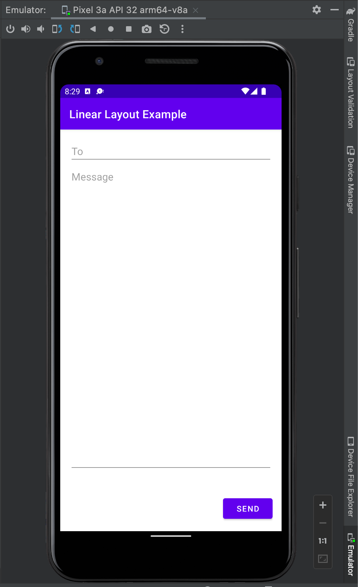
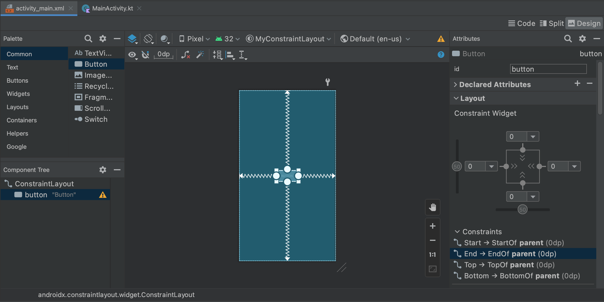

Welcome back to my series on [*Head First Android Development - 3rd Edition*](https://amzn.to/3JoTixn)! This blog post is a continuation of a series of posts I will be doing on reading and working through *Head First Android Development*. This blog deals specifically with chapters three and four. 

Are you new to the series? Please start at the beginning of the series [here](/hfade3-chapter-3-4). 

*Note: This blog may contain affiliate links for books or products I reference. Clicking on these links may result in compensation.*

# Things Are Going to Start Getting Interesting! 

In the next two chapters, things start to pick up! Chapters three and four include the following big ideas:
- Deeper dive into Layouts
- A really deep dive into Constraint Layouts
	- Blueprints
	- Working with ConstraintLayouts


## Chapter 3
In chapter three, we gain a lot of tools in our tool belt, which sets us up for the meat of Chapter 4 about ConstraintLayouts.

This chapter goes a bit deeper into a few different layout types, and their general use cases, specifically:
- LinearLayouts - child views arranged vertically or horizontally
- FrameLayouts - child views stacked
- ScrollViews - use to wrap layouts with a scroll bar



Each layout type was nicely presented with a small app example to build. This chapter (as well as previous ones) employs in-text activities to solidify your knowledge. The most memorable (in my opinion) has been the Refrigerator Magnet ones, which allow you to see some of the code and fill in the blanks.

A big learning point from this chapter was that all layouts extend the View class by extending the ViewGroup class. These layouts require almost all elements in an Android UI to declare their height and width and gain a common API to interact. Also, this is why a developer can nest layouts to create precisely what they need for their app.

For example, you can have a LinearLayout set to vertical orientation with two child LinearLayouts both set to horizontal orientation to have two rows of elements, but those rows are arranged vertically. Although, in the next chapter we quickly find out that this is not the best way to accomplish the task.

# Chapter 4
Complex arrangements using nested layouts are not best practice in Android. In this chapter, we learn that these cause Android OS to do more work than it should because each layout and view is turned into an object in the code. 

The solution (and the meat of this chapter) is the ConstraintLayout. I have seen plenty of ConstraintLayout during my initial coursework with Google. In hindsight, I don't know that the course explained it (or the reasoning) as well as the book.

To teach the reader this concept, the text explains the blueprint view in the Android Studio design editor and the Android Jetpack ecosystem of libraries. Both tools are essential for building a complex UI using ConstraintLayouts.

Chapter four dives deeply into the many abilities of this layout including
- Constraints
- Bias
- Guidelines
- Barriers
- Chains
- Flows



Additionally, this chapter goes into all the relevant Android Studio tools in the Design View to work with ConstraintLayouts. 

Using all of the tools above was quite fun, and I am looking forward to designing and building my apps utilizing them. I am most intrigued by the use of barriers for dynamic resizing of child views that can change the overall layout. I am also interested in chains and flows for proper alignment of elements.

```xml
<androidx.constraintlayout.widget.Barrier  
 android:id="@+id/barrier1"  
 android:layout_width="wrap_content"  
 android:layout_height="wrap_content"  
 app:barrierDirection="bottom"  
 app:constraint_referenced_ids="editTextTextMultiLine,editTextTextMultiLine2"  
 tools:layout_editor_absoluteY="24dp" />
```

```xml
<androidx.constraintlayout.helper.widget.Flow  
 android:id="@+id/flow"  
 android:layout_width="0dp"  
 android:layout_height="wrap_content"  
 android:layout_marginTop="24dp"  
 app:constraint_referenced_ids="button5,button6,button4,button8,button7,button9"  
 app:flow_wrapMode="chain"  
 app:layout_constraintEnd_toEndOf="parent"  
 app:layout_constraintStart_toStartOf="parent"  
 app:layout_constraintTop_toTopOf="parent" />
```

# I’m Only Skimming the Surface on What You Will Find in This Text!
There is so much more to unpack than I have summarized. Truthfully, you should dive into it yourself! 

I am excited to continue with this book and build more apps to gain the knowledge I need to become an Android Developer. Next in the series I will be [covering Chapter 5 and 6](2022-08-03-my-studies-of-head-first-android-development-3rd-edition-chapters-5-6.md) to prove my notes, thoughts, and questions for you. 

What excites you about the prospect of reading it?

### Cross-post
This was also posted on [Dev.to](https://dev.to/ddaypunk/my-studies-of-head-first-android-development-3rd-edition-ch-3-4-1e91) where commments are enabled, and welcomed!

### Sources
*Head First Android Development, 3rd Edition - Dawn Griffiths, David Griffiths*

