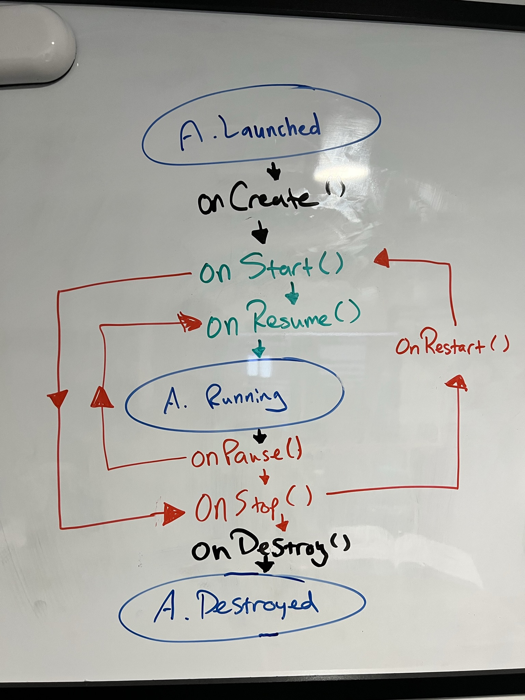

# My studies of Head First Android Development 3rd Edition – Ch 5 & 6
Welcome back to my series on [*Head First Android Development – 3rd Edition*](https://amzn.to/3JoTixn)! This blog post is a continuation of a series of posts I will be doing on reading and working through *Head First Android Development*. This blog deals specifically with chapters five and six. 

Are you new to the series? Please start at the beginning of the series [here](2022-07-18-my-studies-of-head-first-android-development-3rd-edition-chapters-1-2.md). 

*Note: This blog may contain affiliate links for books or products I reference. Clicking on these links may result in compensation.*

# Let's get a Life-cycle!
The next two chapters deal with some fairly core features of the Android operating system and apps in general:
- Chapter 5: *Being an Activity*
- Chapter 6: *Finding your way*

## Chapter 5
This chapter covers a very important concept of Android called the **activity lifecycle**. As mentioned in earlier chapters, an activity is a class that control's the app's behavior, which includes buttons in your UI responding to clicks, or what happens when a user enters information into a text view.

All activities in android apps adhere to a specific lifecycle flow, and this chapter details most of them. Understanding this lifecycle can allow developers to better control behavior in their apps, as well as handle when a user closes the app, or changes its orientation from portrait to landscape (or vice versa).

The book chooses to illustrate this concept with a stopwatch app, which involved leveraging a new view type I had not seen yet, called a **chronometer view**. The most significant part about this view is that it has convenience methods for handling time, which made implementing the app much easier. The problem we will need to solve is handling the time when a user leaves the app, which lifecycle methods can help us understand.

Controlling the lifecycle involves overriding different methods based on the desired outcome.

Activity lifecycle methods discussed:
- `onCreate()` - called following activity launch, usually used to display the layout
- `onStart()` - called following app made visible
- `onResume()` - called after the activity is brought to the foreground again
- `onPause()` - called just before the app is not in the foreground
- `onStop()` - called before app made invisible
- `onRestart()` - called after the activity has been made invisible, and before it is made visible again
- `onDestroy()` - called just before activity destroyed

### What about partial invisibility?
The book quickly discusses on a state where the activity is still partially invisible. For example, this will happen when a Google Assistant card pops up. Usually this only covers a portion of the screen, and in this case it's specifically the bottom. For this type of pause, we use the `onPause` and `onResume` methods, as opposed to the `onStop` and `onRestart` methods. This is due to the fact that the methods would do the exact same thing, and in the full lifecycle flow, run one after another anyway. To be more specific, `onStart` and `onRestart` are followed by `onResume`, and `onStop` is followed by `onPause()`. So in this case we can omit the extras, but this is not always true. The book really tries to drive the lifecycle point home with state by state descriptions, including node charts and activities to complete.

### Saving state to a Bundle
How do we save state when the app is not in focus? Android's simplest option for that is a **Bundle**. It allows a developer to save the current state, and then retrieve it when the app regains focus.

With the Chronometer app, most of the work ends up being done in the `onStart` and `onStop` methods. Within our override of `onStop` we need to save the current state to the Bundle. 

This chapter is quite crucial to understanding how an activity works, so I made sure to attempt drawing the diagram from memory a few times for practice.



## Chapter 6
The next chapter chooses to focus on Fragments, which is another important layer on top of Activities. Fragments, in short, are sort of like sub-activities, and are the way that Android solves apps that require more than one screen without using multiple activities. Instead, we can use a single activity that hosts multiple fragments, and simplify the code using [Android's Jetpack Navigation component](https://developer.android.com/guide/navigation/).

Fragments have their own lifecycle, similar to Activities, but with more/different optional methods to override, most importantly is `onCreateView()`, which executes each time our Fragment layout is needed. Upon further review of the chapter and my notes for it, I noticed they do not include the full fragment lifecycle flow at this point; however, I do remember seeing one later in the book. So we will definitely cover that at a later point!

Instead, the book continues with a basic setup for a Fragments code, which does resemble an activity. Although, it is called out fairly quickly that a Fragment does not extend an Activity, and defines its own similar methods instead of inheriting them.

Our main activity layout would end up looking something like this by using the Navigation component:
```xml
<androidx.fragment.app.FragmentContainerView  
    xmlns:android="http://schemas.android.com/apk/res/android"  
    xmlns:app="http://schemas.android.com/apk/res-auto"  
    xmlns:tools="http://schemas.android.com/tools"  
    android:id="@+id/nav_host_fragment"  
    android:layout_width="match_parent"  
    android:layout_height="match_parent"  
    android:padding="16dp"  
    android:name="androidx.navigation.fragment.NavHostFragment"  
    app:navGraph="@navigation/nav_graph"  
    app:defaultNavHost="true"  
    tools:context=".MainActivity"/>
```

We then would override `onCreateView()` to correctly inflate the layout for this particular fragment:
```kotlin
class ExampleFragment : Fragment() {  
    override fun onCreateView(  
        inflater: LayoutInflater,  
        container: ViewGroup?,  
        savedInstanceState: Bundle?  
    ): View? {  
        val fragmentView = inflater.inflate(R.layout.fragment_welcome, container, false)  
  
        return fragmentView  
    }  
}
```

Once we have the inflated view layout for the fragment, we can wire up a button with a click listener to then navigate to another fragment using :
```kotlin
// within ExampleFragment onCreateView() after fragment layout inflated
...

val startButton = fragmentView.findViewById<Button>(R.id.start)  
  
startButton.setOnClickListener {  
 fragmentView.findNavController()  
    .navigate(R.id.action_fromFragment_to_toFragment)  
}

...
```

## My Current feelings on the book overall
I am really enjoying the way this book explains complex concepts. It tends to repeat concepts multiple different ways, designed for how the human brain works. This reminds me of the days I used to work in customer support, and had to explain to non-technical folks what an external IP address is. The variety of activities I have had the chance to work through have certainly helped with retention of the concepts over time.

## Here's to the next chapters!
There is so much more to unpack than I have summarized. Truthfully, you should dive into it yourself! 

I am looking forward to continuing this journey with you all and building more apps as I gain the knowledge I need to become an Android Developer. Next in the series I will be covering Chapter 7 and possibly 8, but I haven't decided yet. As you may have noticed, the posts are getting a bit longer, but I want to keep them a reasonable length. Let me know in the comments if you think they are getting too long!

What app would you make if you could? After reading this book, I bet you could to it!

### Cross-post
This was also posted on [Dev.to](https://dev.to/ddaypunk/my-studies-of-head-first-android-development-3rd-edition-ch-5-6-3bfj) where commments are enabled, and welcomed!

### Sources
*Head First Android Development, 3rd Edition – Dawn Griffiths, David Griffiths*